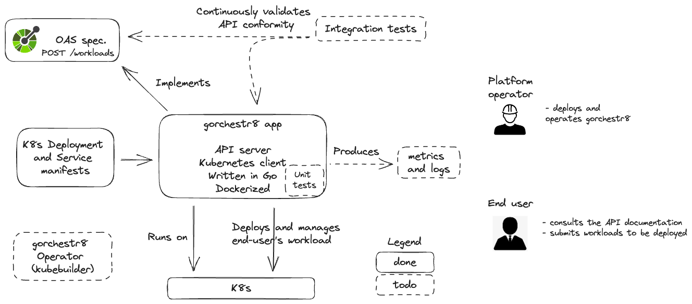

# gorchestr8

[](https://youtu.be/IJwfsCJzYWE "Quick overview of gorchestr8")


## Introduction 

`gorchestr8` is a workload orchestrator for Kubernetes written in Go. The idea behind it is to provide a service that can democratize access to various types of compute resources for different skill levels and developer experiences. For example, `gorchestr8` could make it easy for anyone to run AI workloads on any compute infrastructure, on any cloud provider. It is a toy project that I'm using to experiment with a number of technologies and ideas:

* Go programming
* Creating APIs
* Provisioning workloads on Kubernetes

The diagram below gives an idea of what it does today and what the next steps are: 



gorchestr8 is a Go application that runs on Kubernetes and exposes an API that expects a `POST` request on its `/workloads` endpoint with a JSON request payload that contains a workload name and reference to a container image, for example:

```json
{
    "name": "texttospeachmodel",
    "image": "ai-research/texttospeachmodel:1.12"
}
```

It then proceeds to deploy the specified workload onto the same Kubernetes cluster that `gorchestr8` is running on. 

## How to

You can run this project on a cluster such as Minikube. You can start a minikube cluster like so: 

```sh
minikube start
```

We can then use the manifests provided in this repo to deploy gorchestr8 and expose it as a service inside the cluster. This deployment references a pre-built gorchestr8 docker image on Docker Hub, but you're welcome to rebuild the app yourself if you wish:

```sh
kubectl apply -f deployments/deployment.yaml
kubectl apply -f deployments/service.yaml
```

Check to make sure gorchestr8 is running:

```sh
kubectl get po
NAME                          READY   STATUS    RESTARTS   AGE
gorchestr8-54fbd6bff4-mvmzx   1/1     Running   0          26s
```

And lets also get the service's clusterIP so that we can invoke it later:

```sh
kubectl get svc                                                      
NAME         TYPE        CLUSTER-IP      EXTERNAL-IP   PORT(S)    AGE
gorchestr8   ClusterIP   10.96.239.110   <none>        3333/TCP   4m52s
```

gorchestr8 is going to use the default service account, and we need to give it the right to edit resources in the default namespace, so that later it can deploy workloads on behalf of the end user:

```sh
kubectl create clusterrolebinding default-view --clusterrole=edit --serviceaccount=default:default`
```

Start a curl pod in a new terminal that we'll use to simulate a gorchestr8 HTTP client:

```sh
kubectl run mycurlpod --image=curlimages/curl -i --tty -- sh
```

If ever you exit the curl pod you can access it again like so:

```sh
kubectl exec -i --tty mycurlpod -- sh
```

From the curl pod, we can now invoke gorchestr8 and ask it to deploy a workload for us. Here I'm asking to deploy a workload called `mywebserver` and to use the image `nginx` with the `latest` tag:

```sh
curl -X POST -H 'Content-Type: application/json' -d '{"name":"mywebserver", "image": "nginx:latest"}' 'http://10.96.239.110:3333/workloads'
```

Notice that if you pass any incorrect values or structure to the API, you will (generally) get helpful error messages:

```sh
kubectl exec -i --tty mycurlpod -- sh                                                             
~ $ curl -X POST -H 'Content-Type: application/json' -d '{"name":"Mywebserver", "image": "nginx:latest"}' 'http://10.96.239.110:3333/workloa
ds'
Deployment.apps "Mywebserver" is invalid: [metadata.name: Invalid value: "Mywebserver": a lowercase RFC 1123 subdomain must consist of lower case alphanumeric characters, 
...
```

Check to see that gorchestrate has succesfully deployed your workload for you:

```sh
kubectl get po
NAME                           READY   STATUS    RESTARTS        AGE
gorchestr8-54fbd6bff4-zg6lc    1/1     Running   0               6m48s
mycurlpod                      1/1     Running   1 (9m30s ago)   9m40s
mywebserver-5c74ffc495-g6l6z   1/1     Running   0               104s
mywebserver-5c74ffc495-rg5c4   1/1     Running   0               104s
```

## TODO

Lots of improvement ideas, in no particular order:

- Manage the full lifecycle of a workload (delete, view status)
- Improve the OAS file 
- Reduce the gorchestr8 docker image size
- Support an additional declarative workflow style (that would enable gitops for the end user) as opposed to the current imperative-style API calls
- Unit tests
- Integration tests
- Deploy more realistic workloads (not just a Deployment + Service)
- Provide the end user with more configuration options other than just the image name and image reference
- expose gorchestr8's API outside the cluster
- ... 
